# Task 1: Creating Groups and Users

In this task, we will create groups, create users, and assign each user to the appropriate group.

## Creating the Groups

First, let's create the groups for each department:

```bash
sudo groupadd devs
sudo groupadd management
sudo groupadd support
```

We can then list the groups to verify that they were created successfully.

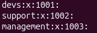

## Creating the Users

Now let's create our users and assign each one to their appropriate department.

### Development

* `sara` → `devs`
* `ahmed` → `devs`
* `khalid` → `devs`

### Support

* `mohammed` → `support`
* `nora` → `support`

### Management

* `faisal` → `management`

Each user will be created with:

* A home directory
* Bash as their login shell
* Their department as their primary group

The command structure is:

```bash
sudo useradd -m name -g group -s /bin/bash
```

Here:

* `-m` creates the user's home directory.
* `-g` assigns the specified group as the user's primary group.
* `-s /bin/bash` sets Bash as the user's login shell.

For example:

```bash
sudo useradd -m sara -g devs -s /bin/bash
```

The same process is repeated for all employees.

## Verifying the Users

Now let's verify the users before and after creating the accounts.

### Before

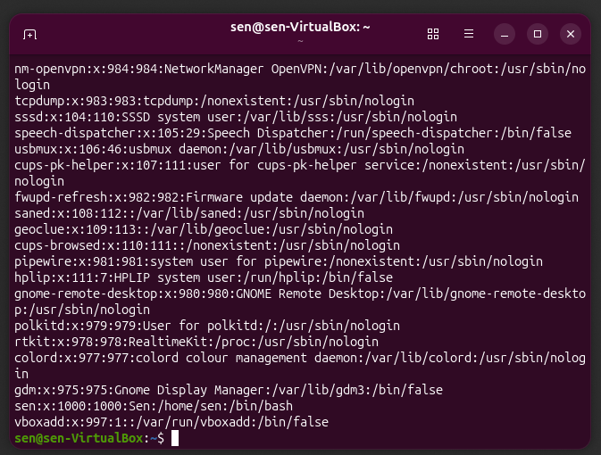

### After

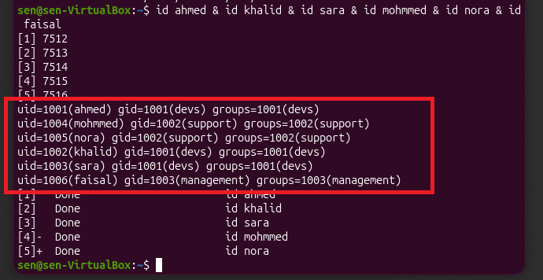

## Checking `/etc/passwd`

We can also check the users' entries in `/etc/passwd`.

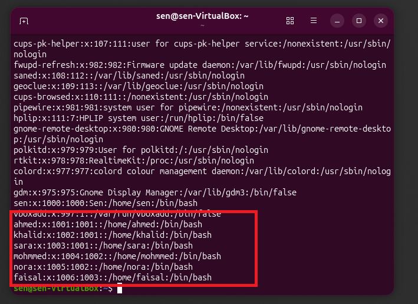

From these entries, we can verify that each user:

* Has been created successfully.
* Has the appropriate department group.
* Has a home directory.
* Has Bash configured as their login shell.

## Testing User Login

Finally, let's test switching to another user. We will switch to `ahmed` and check his information.

```bash
su - ahmed
```

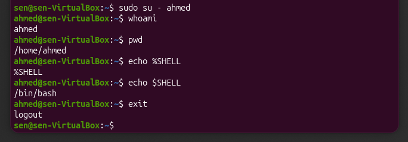

From the result, we can verify that:

* The current user is `ahmed`.
* The login shell is Bash.
* Ahmed has a home directory.

This confirms that the user account was created and configured correctly.
# Task 2: Department Directories and Permissions

In this task, we will create a company directory with a separate folder for each department and set permissions at the group level.

## Creating the Company Directories

Let's start by creating the directories:

```bash
sudo mkdir -p /company/{dev,support,management,shared}
```

The `-p` option allows us to create nested directories in one command. This lets us create the four directories under `/company` without having to run `mkdir` four separate times.

The `shared` directory will be accessible by all employees. The department directories, however, will have their own group-level restrictions.

## Setting Department Permissions

Now let's configure the ownership and permissions for each department directory.

The basic commands are:

```bash
sudo chown root:groupname /company/<department-folder>
sudo chmod 770 /company/<department-folder>
```

### Understanding the Commands

`root` is the user owner of the directory. In this case, the administrator owns the directory.

`groupname` is the group owner. When permissions are applied at the group level, members of this group are affected by the group permissions.

The `770` permission means:

* The first `7` gives the owner `read`, `write`, and `execute` permissions.
* The second `7` gives the group `read`, `write`, and `execute` permissions.
* The final `0` gives all other users no permissions.

Therefore, users outside of the department group cannot access, modify, or execute resources within that department's directory.

For example:

```bash
sudo chown root:devs /company/dev
sudo chmod 770 /company/dev
```

We can check the permissions of the development directory:

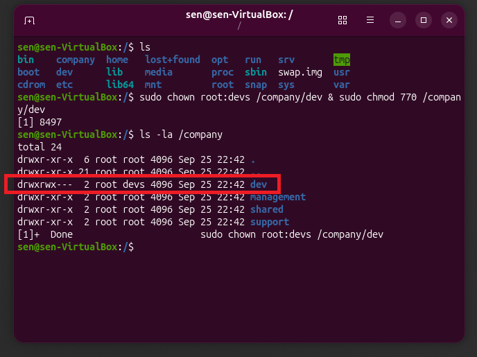

We then apply the same process to the remaining department directories and use `ls -la` to view all of their permissions:

```bash
ls -la /company
```

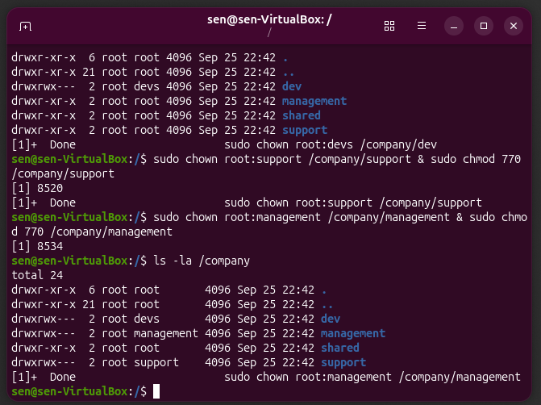

## Testing Department Permissions

Now let's test the permissions.

First, we will create a text file called `github-links.txt`, assign it to the `devs` group, configure its permissions, and place it inside the development directory.

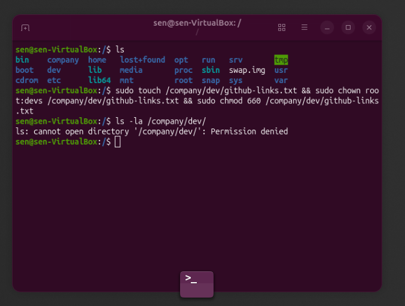

As we can see, attempting to access the file as a user without the appropriate permissions results in:

```text
Permission denied
```

### Testing with a Development User

Let's switch to a development user. In this case, we will use Sara.

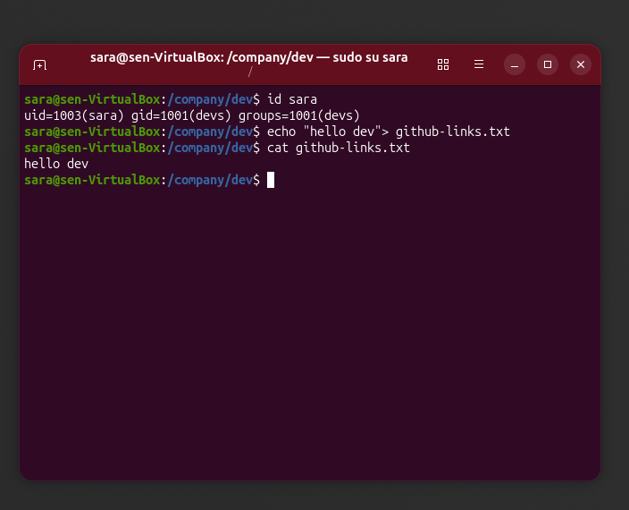

Sara is a member of the `devs` group, so she is able to read and write to the file according to the permissions we configured.

### Testing with a Different Department

Now let's switch to Nora, who belongs to the `support` group, and try to access the same file.

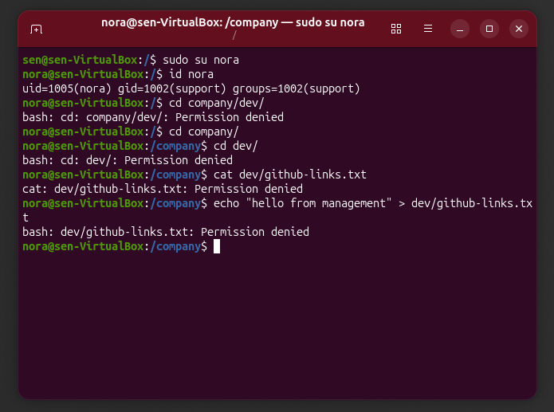

As expected, Nora cannot access the development resource because she is not a member of the `devs` group.

This demonstrates how group-level permissions can be used to separate access between departments.

## Creating a Shared Directory

Now let's create a shared directory system.

The `/company/shared` directory has already been created. We will create a supplementary group called `shared` and add all employees to this group.

The shared directory will then be accessible to members of the `shared` group and the administrator.

First, create the group:

```bash
sudo groupadd shared
```

Then add each employee to the group:

```bash
sudo usermod -aG shared username
```

The `-aG` options are used to add a user to a supplementary group:

* `-a` means append the user to the existing supplementary groups instead of replacing them.
* `-G` specifies the supplementary group to add the user to.

We can then check the members of the `shared` group:

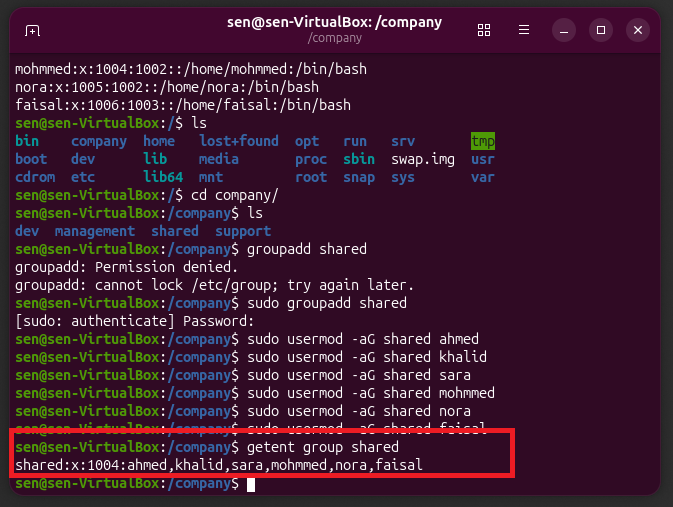

## Setting Shared Directory Permissions

Finally, we set `root` as the owner and `shared` as the group owner, then apply the same `770` permission model:

```bash
sudo chown root:shared /company/shared
sudo chmod 770 /company/shared
```

We can check the final result:

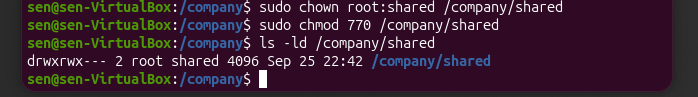

## Testing Access to the Shared Directory

Let's test access to the shared resource by switching to Ahmed.

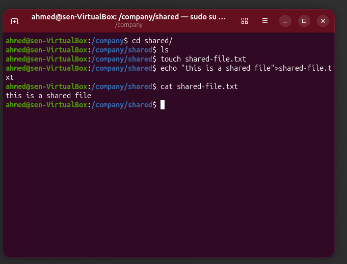

Because Ahmed belongs to the `shared` group, he can access and write to the shared directory.

### Testing a User Outside the Shared Group

Finally, let's create a new user who is not a member of the `shared` group and test the permissions.

I created a user called `sabo`. I initially forgot to give the user a login shell, so I configured one and then attempted to access the shared directory.

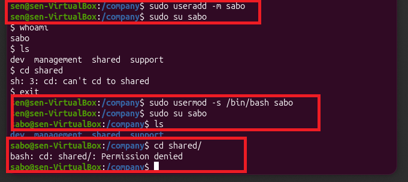

As expected, the user was denied access because they are not a member of the `shared` group.

## Result

The company directory structure is now configured with department-level access control:

* `dev` is accessible by members of `devs`.
* `support` is accessible by members of `support`.
* `management` is accessible by members of `management`.
* `shared` is accessible by members of `shared`.
* Users outside the appropriate groups are denied access.
* `root` retains administrative access to all directories.


# Task 3: Employee Offboarding

In this task, we will offboard Sara from the system.

However, there is an important question to consider: what happens to the files and company data stored in Sara's home directory?

We do not want to delete her account and accidentally lose access to company data. Instead, we will follow an offboarding sequence that disables her access while preserving her files.

## 1. Lock Sara's Account

First, we will lock Sara's account:

```bash
sudo passwd -l sara
```

We can verify that the account has been locked with:

```bash
sudo passwd -S sara
```

This prevents Sara from authenticating with her password while keeping the account and its files intact.

## 2. Check Sara's Group Memberships

Before removing Sara's access, let's check which groups she belongs to:

```bash
id sara
```

We can then remove her from the groups she no longer needs:

```bash
sudo gpasswd -d sara groupname
```

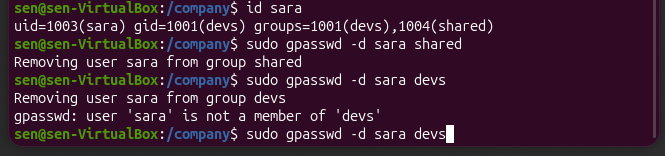

In the result above, we can see that Sara was removed from the `shared` group but not from `devs`.

### Why wasn't Sara removed from `devs`?

The reason is that `devs` is Sara's **primary group**.

The `gpasswd -d` command is used to remove a user from a supplementary group. It cannot remove a user's primary group.

The solution is to change Sara's primary group to another group.

We can use a private group for Sara:

```bash
sudo groupadd sara
sudo usermod -g sara sara
```

Now Sara's primary group is `sara` instead of `devs`.

We can verify the change with:

```bash
id sara
```

At this point, Sara no longer has access through either the `devs` or `shared` group.

## 3. Check Sara's Files

Now that Sara's account has been locked and her department access has been removed, we need to consider the data in her home directory.

We can check it with:

```bash
ls -la /home/sara
```

In our example, Sara does not have any company files that need to be preserved, so no further action is required.

However, in a real environment, an employee may have important company data stored in their home directory. In that case, we should preserve the data before removing or deleting the account.

## 4. Archive Employee Data

If Sara had important files, we could create an archive directory and compress her home directory:

```bash
sudo mkdir -p /home/archives
sudo tar -czf /home/archives/sara-$(date +%Y-%m-%d).tar.gz /home/sara
```

This creates a compressed `.tar.gz` archive containing Sara's home directory and its files.

The archive can then be retained for administrative or data-recovery purposes while Sara's account remains disabled.

## Conclusion

Sara has now been successfully offboarded:

* Her account has been locked.
* Her `shared` group membership has been removed.
* Her primary group has been changed from `devs` to her private `sara` group.
* Her home directory remains intact.
* If company data existed, it could be archived before the account is eventually deleted.

This completes **Day 1: User and Access Management**.
